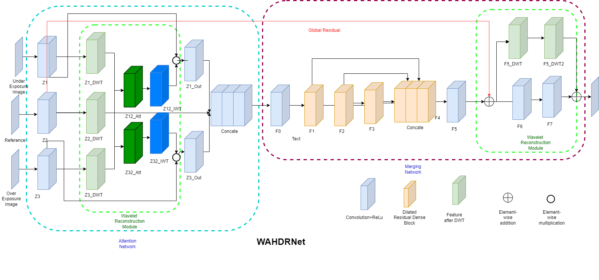

# WHDRNet
### Introduction
WHDRNet is a deep network for HDR image. The code is adapted from the AHDRNet.
### Structure



### Instructions
Training from scratch

```
script_training.py
```
Test pre-trained model to generate result and metrics
```
scrip_testing.py
```
Plot attention region
```
attention.ipynb
```
### Results 
