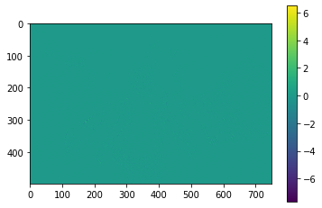
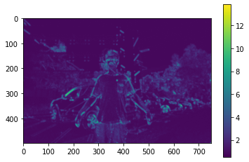
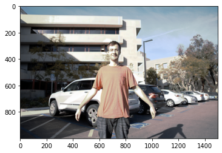

# WHDRNet
### Introduction
WHDRNet is a deep network for HDR image. The code is adapted from the AHDRNet.
### Structure


### Instructions
Training from scratch

```
script_training.py
```
Test pre-trained model to generate result and metrics
```
scrip_testing.py
```
Plot attention region
```
attention.ipynb
```
Plot prehooked inpup and output of DWT
```
DWT_plot.ipynb
```
Test certain image and compare with ground truth.
```
test.ipynb
```
Model definition
```
model.py
```
Pretrained model
```
trained-model/...
```
### Results 
After Wavelet transferm, feature map is transfered to 4 subbands: HH HL LH and LL bands. HH band for one of the feature is shown below.
 


After several Conv layers, the feature map change to the result below.
 


When running the baseline model, the output is as follow.
In comparison, the proposed method achieved the similar result with same training setting in below.
 
